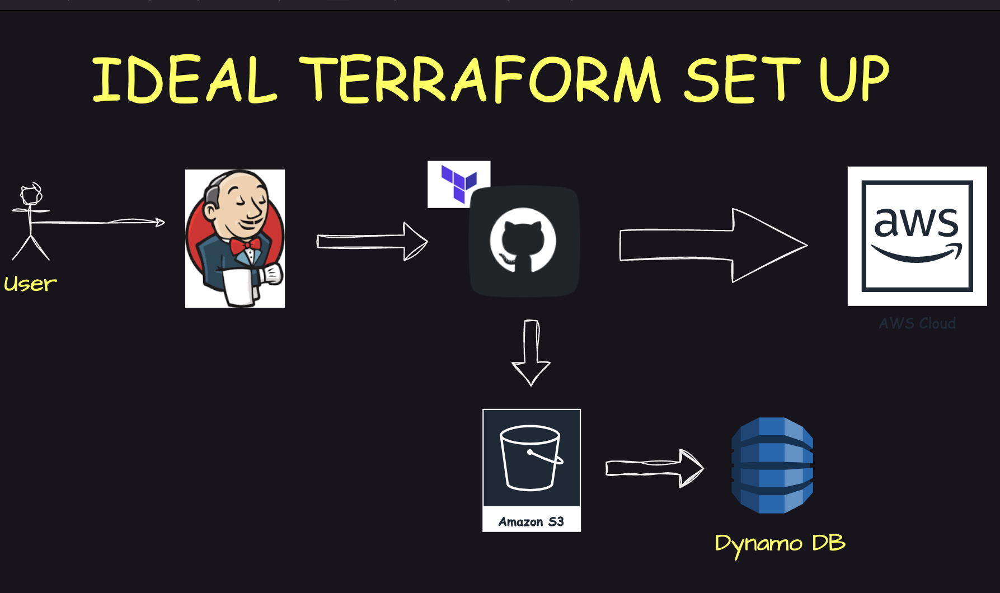

# How to create a ec2 instance using Terraform


### Set up an AWS EC2 instance

1. Create an IAM user & login to your AWS Console
    - Access Type - Password
    - Permissions - Admin
2. Create an EC2 instance
    - Select an OS image - Ubuntu
    - Create a new key pair & download `.pem` file
    - Instance type - t2.micro
3. Connecting to the instance using ssh
```
ssh -i instance.pem ubunutu@<IP_ADDRESS>
```

### Installing Terraform on Linux

1. Updating the outdated packages and dependencies
```
sudo apt update
```
2. Install Terraform - [Terraform by HashiCorp](https://developer.hashicorp.com/terraform/install#linux) 


### Getting start

1. Clone this project in the remote VM
```
git clone https://github.com/Sachin-s-DevOps-Projects/myFirst-Terraform-Project.git
cd myFirst-Terraform-Project/aws
```
> NOTE - To do next steps, you will have to configure aws. In some cases, aws cli hasn't been installed by default. So then, you have to install aws cli.

To install aws cli on ec2 instance:
```

curl "https://awscli.amazonaws.com/awscli-exe-linux-x86_64.zip" -o "awscliv2.zip"
sudo apt install unzip -y
unzip awscliv2.zip
sudo ./aws/install
aws --version / aws -v                                     
aws configure

```

2. Entering the project file where main.tf has been included
```
cd myFirst-Terraform-Project/aws
```

3. Initialise terraform
```
terraform init

```


4. Planning terraform
```
terraform plan
```
5. Applying terraform
```
terraform apply
```
> NOTE - We will have to edit the **inbound rules** in the security group of our EC2, in order to allow traffic from our particular port

### A AWS EC2 instance was created🎉


